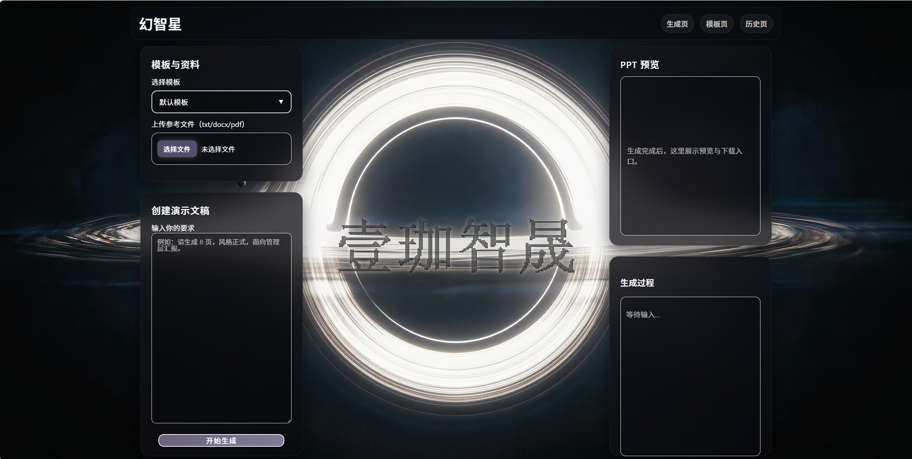
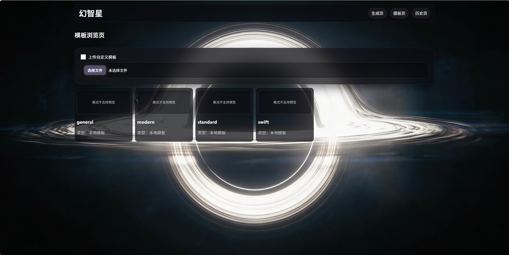
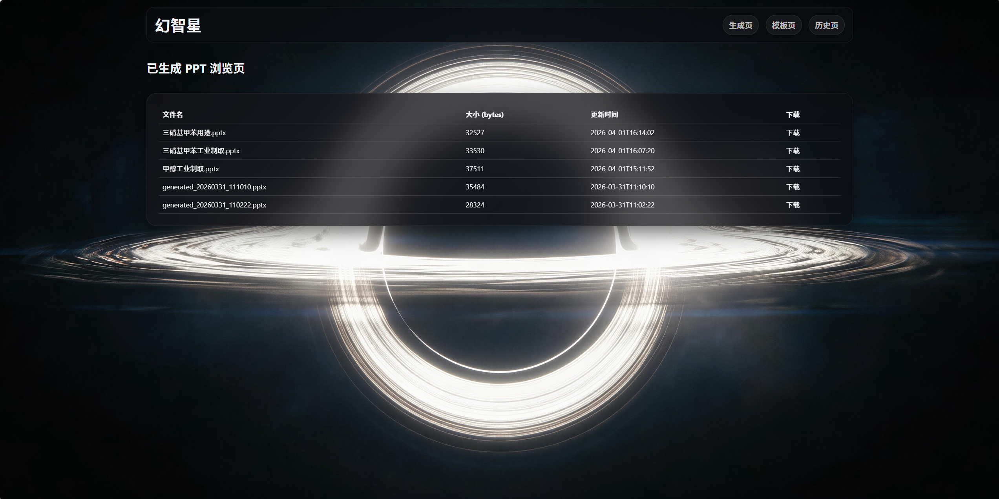
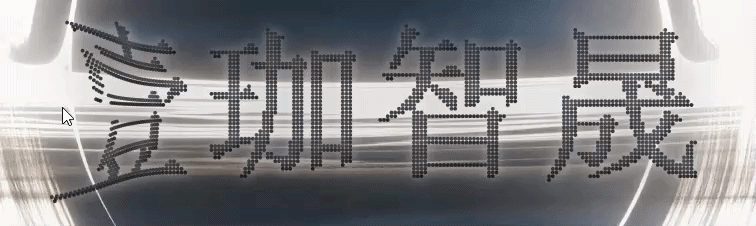

# AetherSlide

> 前后端分离的幻灯片演示平台

## 🖥️ 界面预览

### 首页

### 模板页

### 历史记录页

### LOGO动画演示

## 🚀 快速开始

- **前端**：进入 `frontend` 目录，运行 `npm install && npm run dev`
- **后端**：进入 `backend` 目录，运行 `pip install -r requirements.txt && python app.py`
- 访问 `http://localhost:5173`

## 📦 技术栈

- 前端：React 18 + React Router + Vite 5，开发环境通过 Vite 代理对接后端接口
- 后端：FastAPI + Uvicorn，提供文件上传、SSE 流式生成、PPT 下载与静态资源服务
- 文档与 PPT 处理：python-pptx、python-docx、PyPDF2、pdfplumber、Pillow
- RAG 与本地数据：ChromaDB 本地向量库，`uploads`、`generated`、`rag_store` 保存运行时数据
- 模型调用：通过 `httpx` 调用 OpenAI 兼容的 Chat Completions 接口，配置读取自 `.env`

## 📄 许可证

MIT
